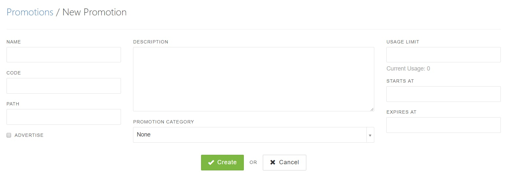
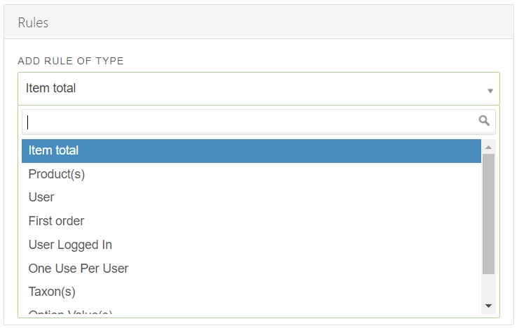
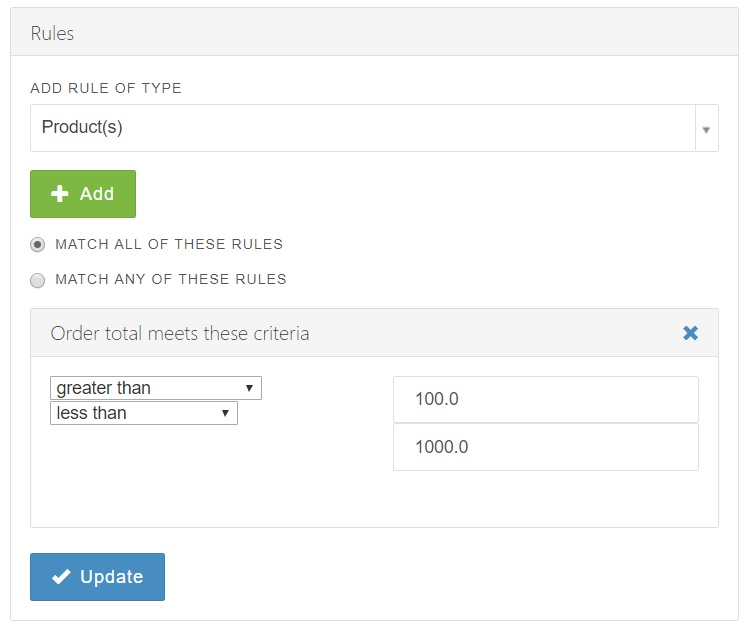
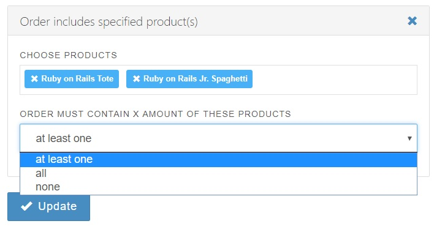
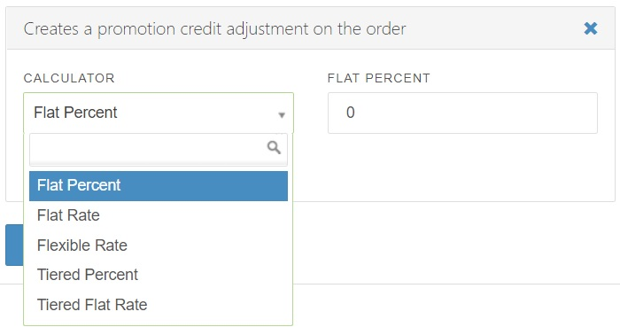
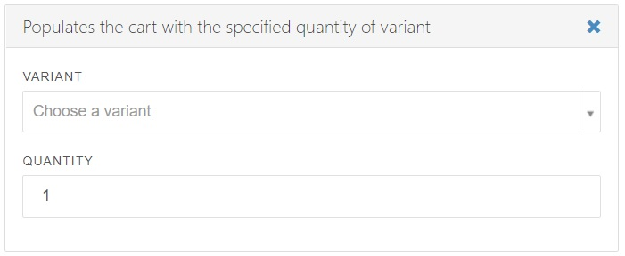

To create a new promotion, click the "New Promotion" button.

The page that renders allows you to set several standard options that apply to all promotions. Each is explained below.

Option | Description
|---|---|
Name | The name you assign for the promotion.
Event Name | This is what must happen before the system will check to see if the promotion will apply to the order. Options are: **Add to cart** (any time an item is added to the cart), **Order contents changed** (an item is added to or removed from an order, or a quantity for an item in the order changes), **User signup** (a store visitor creates an account on the site), **Coupon code added** (a store visitor inputs a coupon code at checkout. The code has to match what you input for the code value if you select this option), or **Visit static content page** (a store visitor visits a path that you declare. This is often used to ensure that a customer has reviewed your store's policies or has been exposed to some other content that is important to your business model.)
Advertise | Checking this box will make the promotion visible to site visitors as they shop your store.
Description | A more thorough explanation of the promotion. The customer will be able to see this description at checkout.
Usage Limit | The maximum total number of times the promotion can be used in your store across all users. If you don't input a value for this setting, the promotion can be used an unlimited number of times. Beneath this input field is a "Current Usage" counter, which is useful later when you're editing a promotion and need to know how many redemptions the promotion has had.
Starts At | The date the promotion becomes valid.
Expires At | The date after which the promotion is invalid.

When you enter values for these fields and click "Create", a new screen is rendered, giving you access to even more options for fine-tuning your promotion.

## Rules

Rules represent the factors that must be met for a promotion to be applicable to an order. You can set one or more rules for a single promotion. When you set multiple rules, you have the option of either requiring that all of the rules must be met for the promotion to apply, or allowing a promotion to apply to an order if even one of the rules is met.

There are five types of rules. You can only add one rule of each type to a single promotion. Each is explained in detail below.

### Item Total

When you select "Item total" from the "Add Rule of Type" drop-down menu and click "Add", you are declaring an Item Total rule.

You can then set the parameters for this type of rule. Specifically, you can establish whether an order's items must be **greater than** or **equal to or greater than** the amount you set. Click "Update".

***
To remove a rule from a promotion, click the cross icon next to it.

***

### Products

Using a rule of this type means the order must contain **at least one** or **all** of the products you declare.

To create this kind of rule, just select "Product(s)" from the "Add Rule of Type" drop-down menu and click "Add". Start typing in the name of the product(s) you want to apply discounts to into the "Choose Products" box. Click on the correct variants. Choose either "at least one" or "all" from the selection box, and click "Update".

### User

You can use the User rule type to restrict a promotion to only those customers you declare. To create this type of rule, select "User" from the "Add Rule of Type" drop-down menu and click "Add". Start typing in the name or email address of the user(s) you want to offer this promotion to. As the correct users are offered, click them to add them to the list. Click "Update".

### First Order

Select "First order" from the "Add Rule of Type" drop-down menu and click "Add" then "Update" to add a rule of this type to your promotion. This rule will restrict the promotion to only those customers ordering from you for the first time.

### User Logged In

Add a rule of this type to restrict the promotion only to logged-in users. Select "User Logged In" from the "Add Rule of Type" drop-down list, click "Add", then click "Update".

## Actions

Whereas [Rules](#rules) establish whether a promotion applies or not, Actions determine what happens when a promotion does apply to an order. There are two types of actions: [create adjustments](#create-adjustments) and [create line items](#create-line-items).

### Create Adjustments

When you select "Create adjustment" from the "Add Action of Type" drop-down menu and click "Add", the system presents you with several calculator options. These are the same as the options you read about in the [calculators guide](/user/shipments/calculators.html), except that instead of a [price sack calculator](/user/shipments/calculators.html#price-sack), there are two additional calculators: percent per item and free shipping.

By default, when you add a new "Create adjustment" calculator it sets it to a "Flat percent" calculator. You can change this by selecting the new calculator type from the "Calculator" drop-down menu, but you will need to click the "Update" button to get that calculator's specific additional required fields to display.

Each calculator has its own set of required additional information fields.

Calculator Type | Additional Data Required
|---|---|
Flat Percent | Percentage amount
Flat Rate | Amount of discount, and currency
Flexible Rate | The cost of the first item, the cost of each additional item, the maximum number of items included in the promotion, and the currency
Percent Per Item | Percentage amount
Free Shipping | No additional info required

Enter all required information for your calculator type, then click "Update".

### Create Line Items

This action type is a way of automatically adding items to an order when a promotion applies to an order. To add this action to your promotion, select "Create line items" from the "Add Action of Type" drop-down menu and click "Add".

Select the quantity and variant you want automatically added to the customer's order from the product drop-down menu. Click "Update".

!!!
Product variants added through Line Item Action Promotions will be priced as usual. If your intention is to add a free product, you should do both a Line Item action to add the product, and an Adjustment action to discount the cost of that variant.
!!!
