## Introduction.

There is a possibility to edit existing users. Simply when you enter **Users** tab search for the certain user that you would like to edit and press **Edit icon**.

## General Settings

When you first open the account edition page you will see **General Settings**.

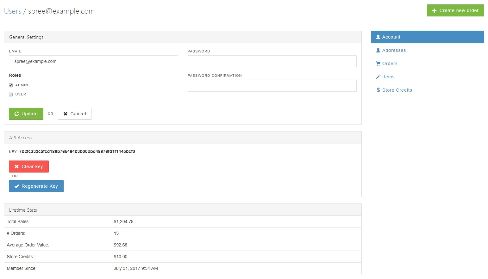

In this page you can make additional changes to the user like email, roles and password. Also you can see, **Clear** and **Regenerate Key** API Key.

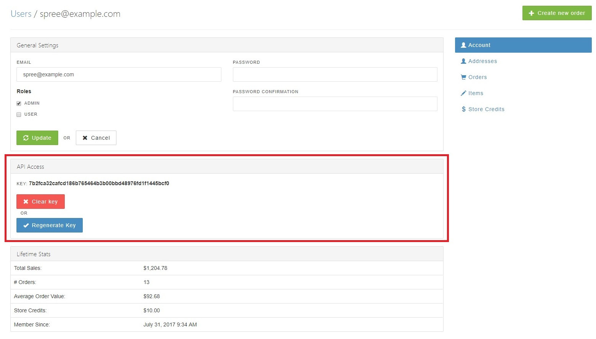

Moreover there are **Lifetime Stats** collected by the Spree. You can see the following:

* **Total Sales** - It defines how much the user has spent money in your shop.
* **Orders** - Shows the number how many orders the user has bought.
* **Average Order Value** - It shows the average price that the user spent in your shop.
* **Store Credits** - You can get more information about Store Credits below.
* **Member Since** - Shows the date when the user created an account on your page.

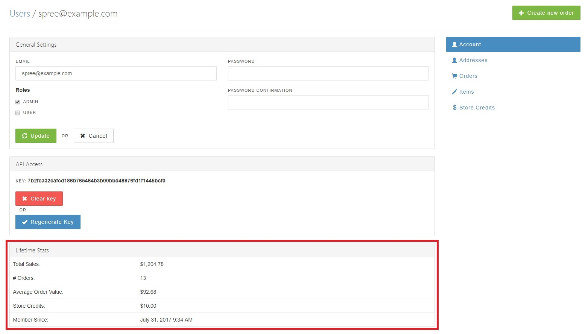

### Addresses

In this section you can manage addresses (**Shipping** and **Billing**) defined by the user during the checkout. There are also **Lifetime Stats** visible on the bottom of this page.
When you make changes in addresses, you have to press **Update** button in order to save the changes, also if you don't want to save them simply press **Cancel** button.

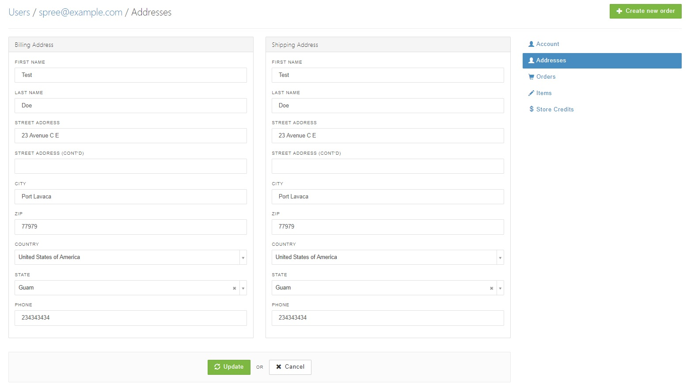

### Orders

There is a simply review of all orders created by the user. There are also **Lifetime Stats** visible on the bottom of this page. Few options are worth to mention:

* **Completed at** - This is the date when the user created certain order.
* **Number** - This is an unique ID for a certain order, also you can move directly to the order when you click the ID.
* **State** - It shows current state for the certain order, you can find more [about order state here](/user/orders/order_states.html).
* **Total** - It shows total price for the certain order.

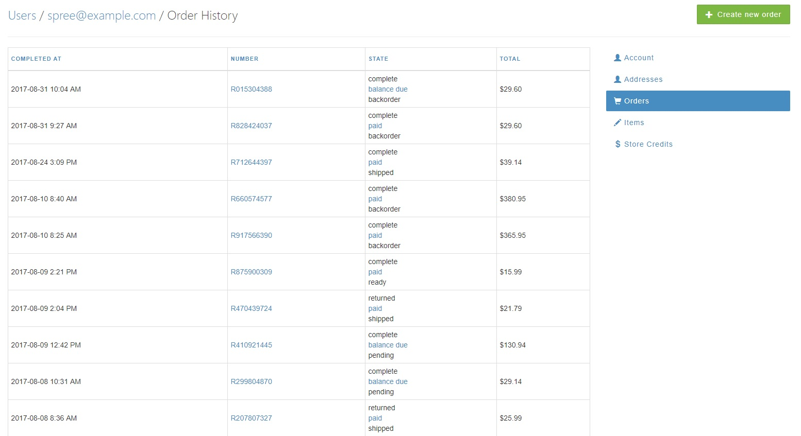

### Items

Very simlar to **Orders** tab, however, few more options are present here about the items purchased by the user:

* **Completed at** - This is the date when the user created certain order for the item.
* **Description** - States the information about certain item, full name of the product, its SKU number and image.
* **Price** - Price without taxes and shipping cost.
* **Quantity** - Total number of purchased product.
* **Total** - It shows total price for the certain order.
* **State** - As previously aformentioned above there is more information [here](/user/orders/order_states.html).
* **Order #** - It shows order's unique ID that hyperlinks you to order's details.

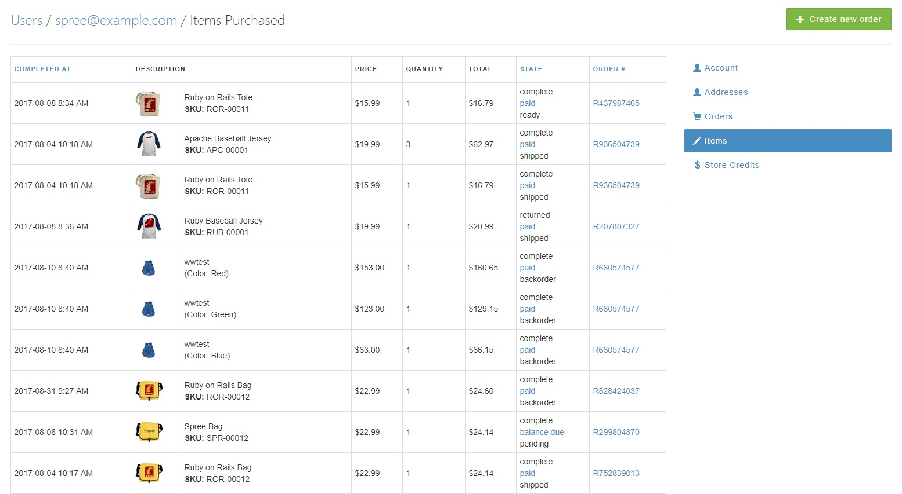

### Store Credits

Firstly, to add store credits to the User, you have to create a **Category** which you can learn about more [here](/user/configuration/configuring_store_credit_categories.html).
Once you create a category you can assign Store Credits to the Users by simply, clicking **Edit** on certain User and pressing **Store Credit** in right panel.

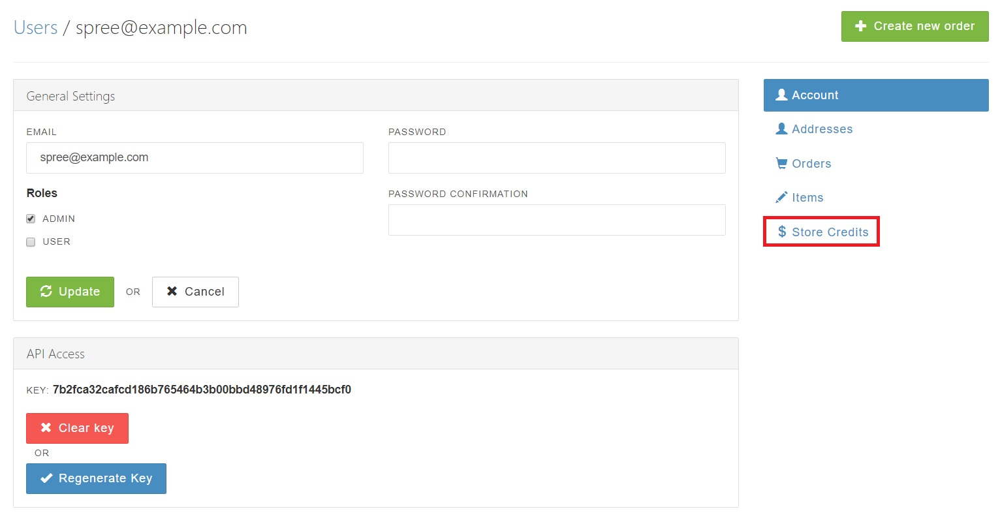

You will see **Store Credit** panel. Like in every other tab in the User's account you can see **Lifetime Stats**.

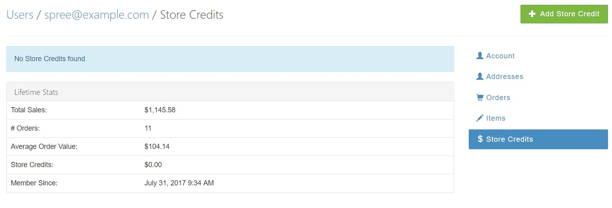

To add Store Credits press **Add Store Credit**. At this point, you can choose value that the User will receive, set Category and describe something important within **Memo** field. Memo field is visible to all other admins that will edit Store Credits added by you. Then just press **Create** button to accept your changes or simply press **Cancel** to exit without saving the changes.

Now you can see how the Store Credits are assigned to the user. New options are visible here:

* **Credited** - Value that shows how much Store Credits has been added to the User account.
* **Used** - Amount of Store Credits spent.
* **Category** - Category that Store Credits were assigned to.
* **Created By** - The Admin's email that added Store Credits to the certain User.
* **Issued On** - Date of granting Store Credits.

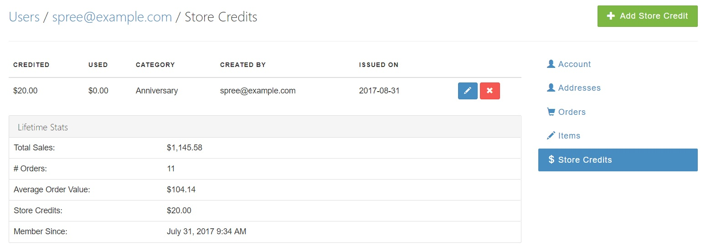

As an Admin you are able to edit or delete Store Credits previously assigned to the User.

Editing Store Credits will present you the same options like adding them.

Those Store Credits are visible to the User in few places during checkout. It's worth to mention that the User is not forced to use Store Credits during Payment step - the Spree default. Spree gives a user choice to pay full price with Credit Card or use Store Credits.

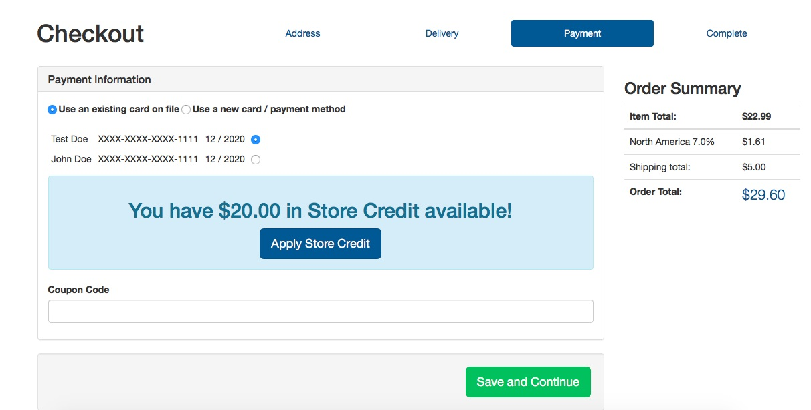

Once the User decides to use the Store Credits there is a possibility to cancel this choice.

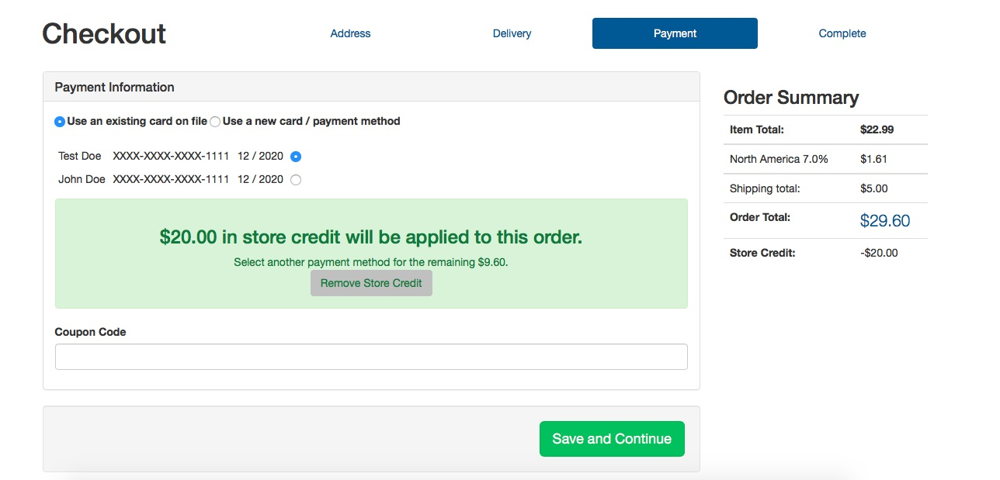

If the user use Store Credits and the amount will not cover whole order's price, rest will be charged off the Credit Card or PayPal.

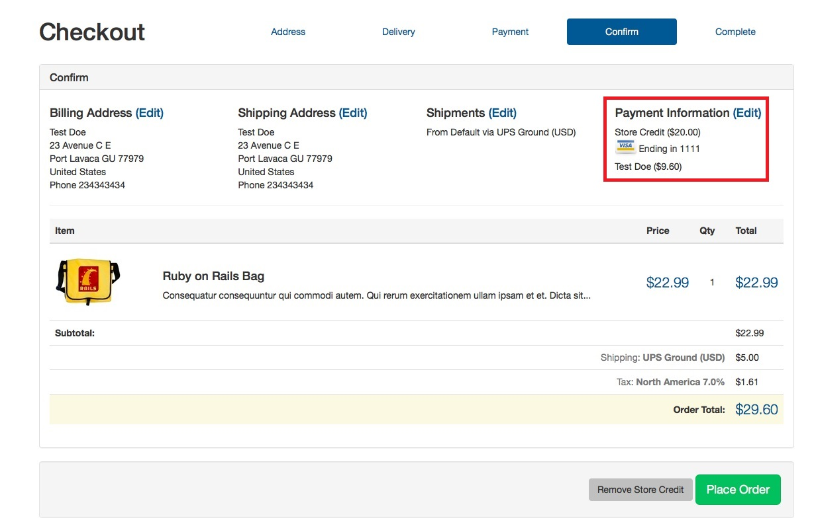

Once the order has been placed there is recapitulation of the order. The user can see the following: **Billing Adress**, **Shipping Address**, **Shipment method** which is previously chosed by the user, **Payment Information** - here, the user can see if and how much of Store Credits has been spent on the order, **Items purchased** and information about order's payment.

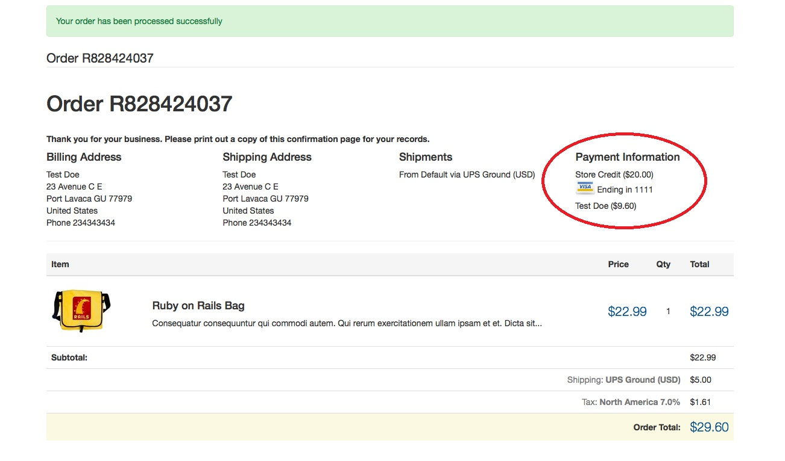

As an Admin you are able to check how the user paid for the order. Simply choose order that you would like to inspect and follow to **Payments** tab. If you don't know yet how to find this tab you can find out [here](/user/orders/entering_orders.html). Admin has to capture the payment manually by default. In order to enable Automatic Payment Capture for the future payments we strongly recommend to read about it [here](/user/payments/payment_methods.html).

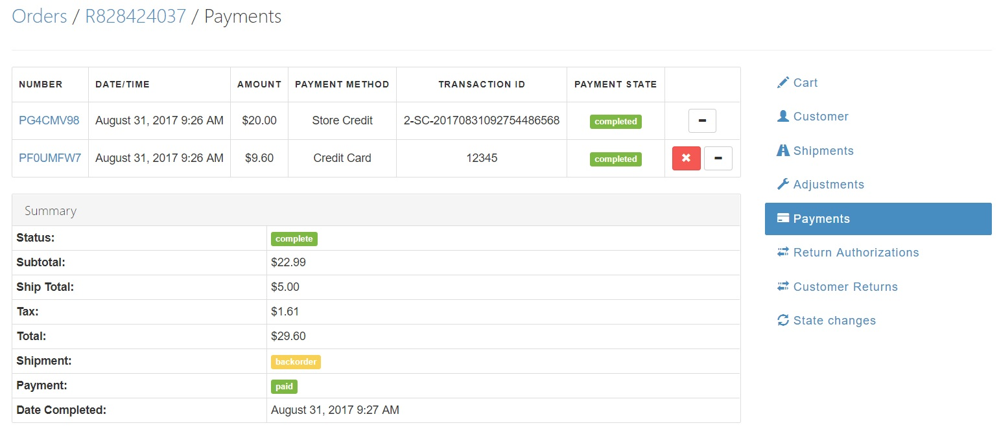

Also as an Admin you can observe used Store Credits in **Users -> Store Credits**.

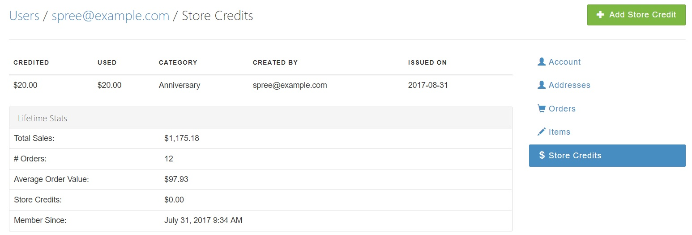
